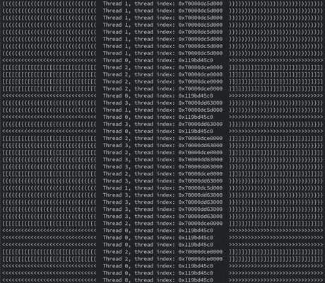
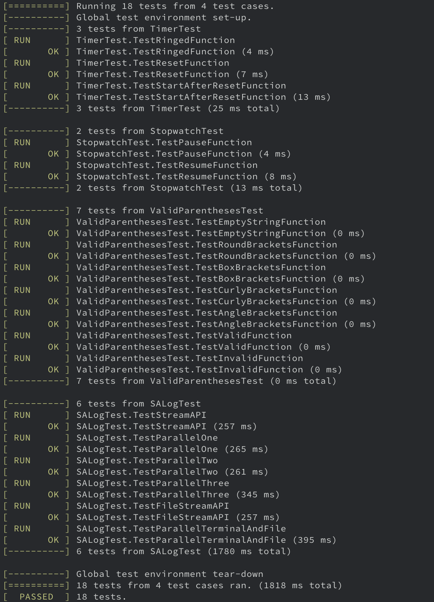

# SALog
A super awesome lightweight C++ logger library.

## Features
- Small and simple! No dependencies! Short compilation time!
- Support logging to terminal or a file according to the configuration.
- Thread-safe! Support multi-threaded logging.
- Logging with streams. As simple as using a generic C++ output stream.
- Support every manipulators and types supported by [`std::ostream::operator<<`](http://www.cplusplus.com/reference/ostream/ostream/operator<</) and [`std::operator<< (ostream)`](http://www.cplusplus.com/reference/ostream/ostream/operator-free/)
- The output format is completely dependent on user input. That is, no prefix will be printed.

## Compiling
1. Clone this repository to your third party library.
    - E.g. `${PROJECT_SOURCE_DIR}/third_party`
2. Include the [`include`](./include) directory
    ```cmake
    include_directories(${PATH_TO_SALOG_FOLDER}/include)
    ```
3. Add to target link libraries.
    - E.g. If you would like to use `salog` in `source.cpp`.
        ```cmake
        add_library(source SHARED source.cpp)
        target_link_libraries(source salog ${OTHER_LIBS})
        ```
4. Use a compiler which supports C++14 to compile.

## Usage
### Logging to Terminal
- Use `salog::tlogger` for logging to terminal.
- E.g.
    ```cpp
    // Logging to terminal
    salog::tlogger << std::setw(30) << std::setfill('-') << '\n';
    salog::tlogger << "I have something to say!" << '\n';
    salog::tlogger << std::setw(30) << std::setfill('#') << '\n';
    salog::tlogger << "This is a text output\n";
    salog::tlogger << std::setw(30) << std::setfill('#') << '\n';
    salog::tlogger << std::setprecision(5) << 3.1415926 << '\n';
    salog::tlogger << std::setw(30) << std::setfill('-') << std::endl;
    ```
    
### Logging to a file
- Use `salog::flogger` for logging to a file.
- Set the output file path before logging to the file.
- E.g.
    ```cpp
    // Set output path
    salog::flogger.set_file("~/log.txt");
    
    // Logging to the file
    salog::flogger << std::setw(30) << std::setfill('-') << '\n';
    salog::flogger << "I have something to say!" << '\n';
    salog::flogger << std::setw(30) << std::setfill('#') << '\n';
    salog::flogger << "This is a text output\n";
    salog::flogger << std::setw(30) << std::setfill('#') << '\n';
    salog::flogger << std::setprecision(5) << 3.1415926 << '\n';
    salog::flogger << std::setw(30) << std::setfill('-') << std::endl;
    ```

### Logging to terminal and a file at the same time
- Set the output file path before logging to the file.
- E.g. [demo.cpp](./misc/demo.cpp)
    ```cpp
    // BracketOutput to terminal
    salog::tlogger << text << ", thread index: ";
    salog::tlogger << std::setw(16) << std::left << std::setfill(' ')
                   << std::this_thread::get_id();

    // BracketOutput to file
    salog::flogger << text << ", thread index: ";
    salog::flogger << std::setw(16) << std::left << std::setfill(' ')
                   << std::this_thread::get_id();
    ```
    

## Test
In the project root of `salog`:
```
mkdir build
cd build
cmake ..
make
../bin/tests
```
 
